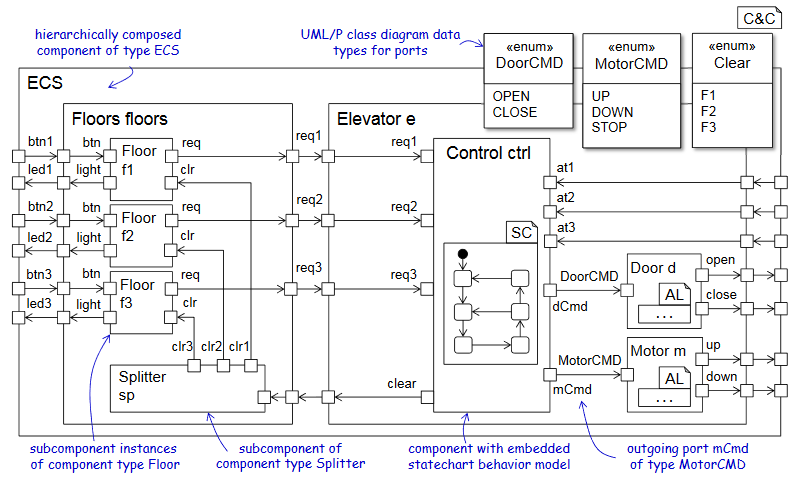

<!-- (c) https://github.com/MontiCore/monticore -->
# MontiArc Core Project

The MontiArc Core repository contains everything related to the common basis of the MontiArc architecture description language. This project is maintained by the [Working Group for Model-Driven Systems Engineering (MDSE)][mdse].

© https://github.com/MontiCore/monticore Contact: [David Schmalzing](https://git.rwth-aachen.de/david.schmalzing)

[se-rwth]: http://www.se-rwth.de
[mdse]:http://www.se-rwth.de/teams/mdse/

## The MontiArc Architecture Description Language



In MontiArc, architectures are described as component and connector systems in which autonomously acting components 
perform computations. Communication between components is regulated by connectors between the components’ interfaces, 
which are stable and built up by typed, directed ports. Components are either atomic or composed of connected 
subcomponents. Atomic components yield behavior descriptions in the form of embedded time-synchronous port automata 
or via integration of handcrafted code. For composed components, the behavior emerges from the behavior of their subcomponents. 

# Installation

## Native installation

### Prerequisites 
- Git (for checking out the project)
- Gradle (for building the project), explicitly version 6.8.3
- Java 8 or 11 (other versions are not checked by the CI pipeline)

### Installation

```
git clone <link to this Git repository>
cd core
gradle build
```

This should build the project. Note, building the project for the first time may
take a while. Subsequent builds should be faster.

Once the project is built, you can look at the generated source code. 
The `languages` folder contains the language components of MontiArc, more 
specifically, their frontend implementation. That is parsers to create abstract
syntax trees (ASTs) from textual models, genitors, and symbol table completers
to construct and complete the symbol table, context condition checks to check
well-formedness, transformations, visitors, and a command line tool that puts 
everything together.

The `generators` folder contains code generators that translate MontiArc component 
models to some general-purpose language. Currently, available are the MontiArc to 
Java (MA2Java) and the CD to Java (CD2Pojo, Pojo for Plain Old Java) generators.

The `application` folder contains some example applications. 
Each of them should contain a `target/generated-sources` subdirectory after
building their respective project. 

Please note that `gradle build` on the topmost folder builds the whole project. 
However, each subproject contains an individual build file. 
Executing the build command on a subproject builds everything needed for that 
project and then builds the project. See the [Gradle Website](https://gradle.org/) 
for more information about the gradle build tool.

# Building and Running Your First Application

This section guides you through building and executing your first application.
We will use the example under `applications/bumperbot`.
It consists of only a few components but should showcase the build process.

We support building an application via an IDE

### Building and Running an Application using an IDE

As MontiArc generates Java code, you can use the same IDE to build both MontiArc 
and MontiArc applications.
The whole build process can be handled by gradle. 
That is, `gradle build` not only generates Java code from MontiArc component 
models, but also compiles the handwritten and generated
code, and executes tests. 
Extending the build process to construct an executable only requires defining the 
main class and setting up the build process to generate an executable.

## Tool Documentation

The [MontiArcTool](language/montiarc-fe/src/main/java/montiarc/MontiArcTool.java) offers capabilities for processing MontiArc component models.
It provides multiple options that can be used as follows:

`java -jar MontiArc.jar [-h] -i <fileName> [-path <p>] [-pp [<file>]] [-s [<file>]]`

where the arguments are:

| Option                            | Explanation                                                                                    |
|-----------------------------------|------------------------------------------------------------------------------------------------|
| `-h, --help`                      | Prints the help dialog.                                                                        |
| `-v, --version`                   | Prints version information.                                                                    |
| `-mp, --modelpath <dirlist>`      | Sets the artifact path for the input component models, space separated.                        |
| `-path <dirlist>`                 | Sets the artifact path for imported symbols, space separated.                                  |
| `-pp, --prettyprint <dir>`        | Prints the AST of the component models to stdout or the specified directory (optional).        |
| `-s, --symboltable <dir>`         | Serializes and prints the symbol table to stdout or the specified output directory (optional). |

Exemplary usage:

```
  java -jar MontiArc.jar -h
  java -jar MontiArc.jar -mp applications/bumperbot/src/main/resources
``` 

The [MA2JavaTool](generators/ma2java/src/main/java/montiarc/generator/MontiArcTool.java) extends the MontiArcTool with code generating capabilities. It provides the following options in addition to those defined above:

| Option                             | Explanation                                              |
|------------------------------------|----------------------------------------------------------|
| `-o, --output <dir>`               | Sets the target path for the generated files (optional). |
| `-hwc <dir>`                       | Sets the artifact path for handwritten code (optional).  |

## Further Information

* [Project root: MontiCore @github](https://github.com/MontiCore/monticore)
* [MontiCore documentation](http://www.monticore.de/)
* [**List of languages**](https://github.com/MontiCore/monticore/blob/dev/docs/Languages.md)
* [**MontiCore Core Grammar Library**](https://github.com/MontiCore/monticore/blob/dev/monticore-grammar/src/main/grammars/de/monticore/Grammars.md)
* [Best Practices](https://github.com/MontiCore/monticore/blob/dev/docs/BestPractices.md)
* [Publications about MBSE and MontiCore](https://www.se-rwth.de/publications/)
* [Licence definition](https://github.com/MontiCore/monticore/blob/master/00.org/Licenses/LICENSE-MONTICORE-3-LEVEL.md)

