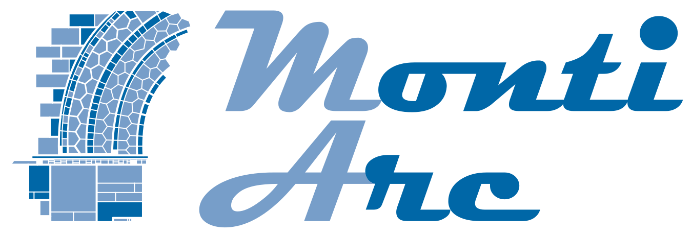

<!-- (c) https://github.com/MontiCore/monticore -->
<h1 align="center">
  <picture>
    
  </picture>
</h1>

<h4 align="center">
  <a href="https://monticore.github.io/montiarc">Documentation</a> |
  <a href="https://monticore.github.io/montiarc/v7.10/GettingStarted">Getting Started</a> |
  <a href="https://www.monticore.de/">MontiCore</a>
</h4>

# The MontiArc Architecture Description Language

MontiArc is a textual architecture description language (ADL) for the 
specification and modeling of cyber-physical systems. 
The architecture of a cyber-physical system is described as a component and 
connector (C&C) system, in which autonomously acting components perform computations. 
Components have clear defined interfaces that consists of stable, typed, directed ports. 
They communicate via these interface in the direction of connectors through streams of messages. 

Each component defines a cyber-physical function, which maps streams of input 
messages to stream of output messages. 
This function is the behavior of the corresponding cyber-physical systems. 
Behavior can be specified through atomic behavior descriptions, such as statecharts, 
or through the composition of subcomponents to form larger systems.

The MontiArc infrastructure provides essential functionality for verifying the 
validity of component and connector models. 
Components can also be translated into Java simulations to simulate, analyze, 
and validate their behavior, for example through automated tests. 
In addition to the basic modeling elements \- components, ports, and connectors \- 
MontiArc supports advanced modeling concepts such as component parameterization, 
variability and feature configuration, dynamic reconfiguration, and generics.

© https://github.com/MontiCore/monticore

### Further Information

* [Documentation](https://monticore.github.io/montiarc)
  * [Setup](https://monticore.github.io/montiarc/v7.10/GettingStarted/Setup)
  * [Contributing](https://github.com/MontiCore/montiarc/blob/dev/CONTRIBUTING.md)
  * [FAQ](https://monticore.github.io/montiarc/v7.10/FAQ)
* [Publications](https://www.se-rwth.de/publications/)
* [License](https://github.com/MontiCore/monticore/blob/HEAD/00.org/Licenses/LICENSE-MONTICORE-3-LEVEL.md)

## About MontiArc
The MontiArc ADL features modeling elements for component type definitions and 
reference declaration for component reuse, ports, connectors, structural 
inheritance, implicit but controlled creation of connectors and subcomponent 
declaration, component parameterization, embedded behavior descriptions, refinement, and static type checking.

### Model Cyber-Physical Systems
Cyber-Physical Systems are inherently distributed, interacting in various ways using signals, messages and data. However, model-based development of Cyber-Physical Systems becomes particularly interesting, when modeling the context of the software control, i.e. electric and hydraulic signals as well as physical material 
(streams of fluids or gadgets) to simulate the system under development early.

MontiArc is suited for modeling all kinds of cyber-physical systems.

### Built-in Simulation Support
MontiArc offers built-in simulation support. Based on its mathematical foundation of Focus,
MontiArc is constructive enough to be used in a simulator or for code generation.
