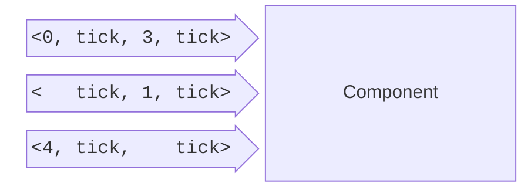
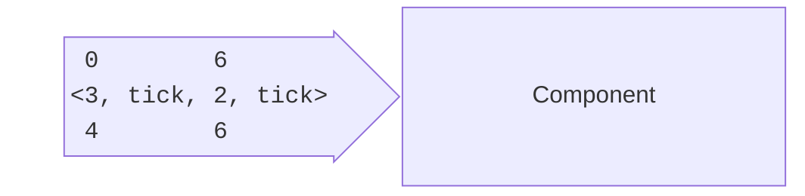

<!-- (c) https://github.com/MontiCore/monticore -->
# Timing

To understand MontiArc you need to know about timings and how they 
affect components. Multiple time abstractions are available in 
MontiArc. We briefly introduce the different timing concepts here. 
MontiArc is based on the mathematical FOCUS[^1] framework, which 
provides clear semantics. 

In MontiArc time is split into equidistant time intervals, where each interval has a finite number of messages.
The granularity of time, i.e., length of intervals, is not modeled and depends on the system's context.
The timing can be described by streams, which contain ordered messages. A pseudo-message called tick separates the time intervals.

During modeling, timings are specified on a per [port](../Component/Interfaces.md) basis.

[^1]: Manfred Broy and Ketil Stølen. *Specification and Development of Interactive Systems. Focus on Streams, Interfaces and Refinement*. Springer Verlag Heidelberg, 2001.

## Timed
The timed timing specification uses events over ports. It is suited for asynchronous communication.

Components can directly react to these events.

## Synchronous
The alternative to timed is synchronous communication. Here all messages over ports are sent and received at the same time once every time interval.
Events in this time domain are tuples over all synchronous ports of a component.

A component can only react to sync messages once all sync ports have received their message. I.e., the input time frame is complete.

