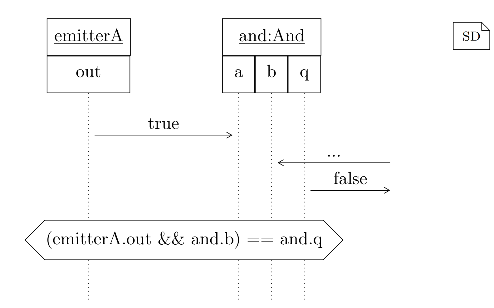

<!-- (c) https://github.com/MontiCore/monticore -->
# Sequence Diagrams for Testing

Sequence diagrams are well suited for the specification and testing of behavior.
Here we will only focus on the testing part.

MontiArc provides an integration for sequence diagrams. They look similar to
UML sequence diagrams, only with some minor modifications.

In general, sequence diagrams are exemplary and describe one possible interaction of a system.
For a detailed definition of sequence diagrams, read [Modeling with UML](https://link.springer.com/book/10.1007/978-3-319-33933-7).

<center>
{ width="600"}
</center>


```sequencediagram
sequencediagram SD1 {
  emitterA;
  and:And;

  emitterA.out -> and.a : true;
  -> and.b : ...;
  and.out -> : false;
  assert (emitterA.out && and.b) == and.q;
}
```

## Embedded

Another possible way to use sequence diagrams is to specify an existing architecture.
For that, an existing decomposed MontiArc model has to be specified for which an 
interaction between the subcomponents can be modeled.


```sequencediagram
<<montiarc="path/to/And.arc">>
sequencediagram AndSD1 {
  visible notA;
  notB;
  nor:Nor;

  -> notA.a : trigger true ;
  notA.q -> nor.a : false ;
  nor.q -> : ... ;

  assert (notA.a && notB.b) == nor.q;
}
```


## Semantics

We have previously said that C&C sequence diagrams are exemplary. This means the modeled
interaction can occur once, multiple times at any frequency, concurrently, or never.
Furthermore, a sequence diagram can be an abstraction of the real execution by omitting
components and interactions. How a sequence diagram models executions can be controlled with matching stereotypes, which can alter the semantics. We define three different
interpretations for sequence diagrams, known from UML sequence diagrams defined by [Modeling with UML](https://link.springer.com/book/10.1007/978-3-319-33933-7). 
They can be applied to the whole model and to individual components,
where applying them to the whole model is equal to applying them to each component
individually. In the graphical notation, the name can be prefixed with a stereotype to
indicate that it should be interpreted correspondingly. In the textual notation, keywords
are used for this purpose.

#### Free
This is the default interpretation and allows any interaction or component to be
omitted. The stereotype is `«match:free»` and the keyword is `free` or `...`.

#### Complete

The opposite of free. No interaction displayed in the timeframe can be omitted,
and all interactions that occur must be included in the model. Interactions outside the
timeframe, that is, interactions before and after the first and last interaction on a timeline,
can still occur and be omitted from the model. The stereotype is `«match:complete»`
and the keyword is `complete`.

#### Visible

Similar to complete, but interactions with components not included in the diagram can be omitted. Interactions between components included in the model, i.e., visible
components, have to be complete. The stereotype is `«match:visible»` and the keyword
is `visible`.
