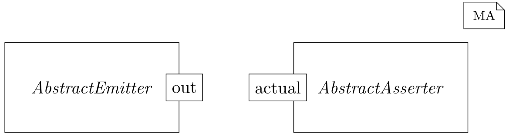

# Writing Automated Tests

An important approach to ensuring system quality is systematic testing. 
Testing is the act of detecting failures in a product.
A failure is a divergence between the expected and actual behavior of software. 
MontiArc includes support for writing automated tests.
These can be run whenever changes are made to ensure that the product remains correct.

## How to Write Tests

In MontiArc, tests are components that verify the behavior of other components.
This is achieved by making assertions over the input and output streams of the 
system we want to test, also called system under test (SUT). 
Test
components typically consist of three parts:

- Setup: Set up the test environment and fixtures.
- Run: Execute the SUT.
- Assert: Verify the SUT’s outputs are what we expected.

A test component is usually [decomposed](./Decomposition.md); one component sets up the environment or uses test fixtures and drives the test by providing inputs.
The SUT produces outputs based on the provided inputs, which are then evaluated and compared against the expected results by a test oracle.

### Test Anatomy

Test component can be identified by the `<<test>>` stereotype in front of the component definition. Take a look at the following example:

=== "Timed"
```
component And {
  port <<timed>> in boolean a,
       <<timed>> in boolean b;
  port <<timed>> out boolean q;

  boolean lastA = false;
  boolean lastB = false;

  automaton {
    initial state S;
    state A;
    state B;

    S -> A a / { lastA = a; };
    S -> B b / { lastb = b; };
    
    A -> A a / { lastA = a; };
    A -> S b / { q = b && lastA; };
    B -> B b / { lastb = b; };
    B -> S a / { q = a && lastB; };
  }
}
```

=== "Sync"
```
component And {
   port <<sync>> in boolean a,
        <<sync>> in boolean b; 
   port <<sync>> out boolean q;

   automaton {
     initial state A;
     A -> A / {
       q = a && b;
     };
   }
}
```

```
<<test>>
component AndTest {
  And sut;

  emitterA.out -> sut.a;
  emitterB.out -> sut.b;
  sut.q -> assertEquals.actual;

  AssertEquals<boolean> assertEquals(true);
  Emit<boolean> emitterA(true);
  Emit<boolean> emitterB(true);
}
```

Here we have two components, one called `And` implementing the logic of a 
binary AND gate, and one testing the `And` component by inputting `true` on 
both ports and expecting `true` to be outputted.
The example makes use of two library components called `Emit` and `AssertEquals`,
which are responsible for the setup and assertions respectively. 

### Parameterized Tests

MontiArc allows the definition of parameterized tests. 
This is useful when wanting to define multiple tests while keeping the overall 
architecture the same.
A test component can have [parameters](./Parameter.md) for which different values can be 
provided, each of which results in an individual test execution.
The values are provided as a list to a stereotype with the same name as the 
parameter. The provided value has to match the type of the parameter.

The following example shows a parameterized test component, which creates `N` 
different test cases. For convenience, if a parameter stays the same over all 
tests than the list can be omitted and a direct value can be assigned.

```
<<test, p1=[val1, val2, ..., valN], p2=valP2>>
component AndTest(T p1, T p2)
```

| Test index | Instantiation          |
|------------|------------------------|
| 0          | `AndTest(val1, valP2)` |
| 1          | `AndTest(val2, valP2)` |
|            | ...                    |
| N-1        | `AndTest(valN, valP2)` |

### Complex Tests

More complex tests can be defined by using other library components that 
produce or assert streams of messages.
The execution length of the test can be set with the `ticks` stereotype, which 
defines the number of ticks that the test should run for.

The following tests the `And` component seen previously more in depth. 
The test is parameterized by the input and output streams of the SUT.

=== "Timed"
```
<<test,
  ticks=3,
  a=[
    [[false, false], [true], [true]],
    [[false, false], [false], [false, true]]
  ],
  b=[
    [[false, true], [false], [true]],
    [[false, true], [false], [true, true]]
  ],
  expected=[
    [[false], [false], [true]],
    [[false], [false], [true]]
  ]>>
  component AndTest(List<List<boolean>> a, 
                    List<List<boolean>> b, 
                    List<List<boolean>> expected) {
  
  And sut;

  emitterA.out -> sut.a;
  emitterB.out -> sut.b;
  sut.q -> assertEquals.actual;

  AssertEqualsTimed<boolean> assertEquals(expected);
  EmitTimed<boolean> emitterA(a);
  EmitTimed<boolean> emitterB(b);
}
```

=== "Sync"
```
<<test,
  ticks=[4, 5],
  a=[
    [false, false, true, true],
    [false, false, false, false, true]
  ],
  b=[
    [false, true, false, true],
    [false, true, false, true, true]
  ],
  expected=[
    [false, false, false, true],
    [false, false, false, false, true]
  ]>>
  component AndTest(List<boolean> a, 
                    List<boolean> b, 
                    List<boolean> expected) {
    And sut;

    emitterA.out -> sut.a;
    emitterB.out -> sut.b;
    sut.q -> assertEquals.actual;

    AssertEqualsSync<boolean> assertEquals(expected);
    EmitSync<boolean> emitterA(a);
    EmitSync<boolean> emitterB(b);
  }
```

Resulting in the following test cases:
=== "Timed"
| Test index | #Ticks | Input `a`                                              | Input `b`                                            | Expected output `q`                      |
|------------|--------|--------------------------------------------------------|------------------------------------------------------|------------------------------------------|
| 0          | 3      | `〈false, false, Tick, true, Tick, true, Tick〉`         | `〈false, true, Tick, false, Tick, true, Tick〉`       | `〈false, Tick, false, Tick, true, Tick〉` |
| 1          | 3      | `〈false, false, Tick, false, Tick, false, true, Tick〉` | `〈false, true, Tick, false, Tick, true, true, Tick〉` | `〈false, Tick, false, Tick, true, Tick〉` |

=== "Sync"
| Test index | #Ticks | Input `a`                                                          | Input `b`                                                        | Expected output `q`                                                |
|------------|--------|--------------------------------------------------------------------|------------------------------------------------------------------|--------------------------------------------------------------------|
| 0          | 4      | `〈false, Tick, false, Tick, true, Tick, true, Tick〉`               | `〈false, Tick, true, Tick, false, Tick, true, Tick〉`             | `〈false, Tick, false, Tick, false, Tick, true, Tick〉`              |
| 1          | 5      | `〈false, Tick, false, Tick, false, Tick, false, Tick, true, Tick〉` | `〈false, Tick, true, Tick, false, Tick, true, Tick, true, Tick〉` | `〈false, Tick, false, Tick, false, Tick, false, Tick, true, Tick〉` |

### Library Components

The library consists of two main component categories: assertion components and emitter
components. The former provide means to compare input streams with expected values,
the latter for generating streams of messages. All assertion components share that they
have a single incoming port called `actual`, while all emitter components have one
outgoing port called `out`. All components lie in the `montiarc.maunit.api` package.

{ width="600"}

##### Asserter

- **`AssertTrue(String message = "")`** The most simple assertion component. It has
  a single untimed input port boolean actual that asserts all incoming messages are
  true. I.e., the input stream has to be `〈true, true, true, ...〉`. If not, it fails the
  current test with the provided message. The message is optional and if an empty string is
  given, the default message `"expected <true> but was <false>"` is used.
- **`AssertFalse(String message = "")`** Like the `AssertTrue` component, but expects the input port boolean actual to be false.
  Assert<T>(Consumer<T> assertion) A generic component that a custom assertion
  method can be supplied to as a parameter. On every message of the untimed input port T
  actual, the provided assertion method is called with the message value as its argument.
- **`AssertEquals<T>(T expected, String message = "")`** A component that can
  make assertions over objects. The expected value is specified by the parameter. This is a
  generic component with a single input port T actual that asserts all incoming messages
  are equal to that parameter expected.
- **`AssertEqualsSync<T>(List<T> expected, String message = "")`**
  A component with a single input port, of type T called actual, that asserts the stream
  of incoming messages is equal to expected interpreted as a synchronous stream. It also
  fails the test if more messages are received than what was expected.
- **`AssertEqualsUntimed<T>(List<T> expected, String message = "")`**
  A component with a single input port, of type T called actual, that asserts the stream
  of incoming messages is equal to expected while ignoring ticks in the stream. It fails the
  test if more messages are received than what was expected.
- **`AssertEqualsTimed<T>(List<List<T>> expected, String message = "")`**
  Like the `AssertEqualsUntimed`, this is a component with a single input port T actual. But, instead of ignoring ticks, the expected values are grouped by ticks, and after
  every tick, the next sublist is expected. If more messages arrive in one tick than are declared in the corresponding sublist the test fails. Likewise, if fewer messages arrive than
  were expected, the test also fails. All received messages have to be equal to the expected
  messages. For example, a list of `[[x, y], [z]]` would be interpreted as an expected stream of `〈x, y, Tick, z, Tick〉`.

##### Emitter

- **`Emit<T>(T output)`** This component will emit a single message of type T with the
  value of output on the sync port out every tick. Resulting in an infinite output stream
  of `〈output, Tick, output, Tick, output, Tick, ...〉`. It can be used to generate a
  mock message every tick to drive a test for sync or timed components.
- **`EmitList<T>(List<T> output)`** A timed variant of the Emit component. Instead of
  a single message, all elements `ei` of output are emitted in one time slice. The resulting output is an infinite stream of `〈e1 , e2 , ..., en , Tick, e1 , e2 , ..., en , Tick, ...〉`.
- **`EmitSync<T>(List<T> output)`** A component that will send the elements of output on the sync port out with a tick after each. After all elements have been sent, the
  output stream is repeated. Consequently, it gives an infinite output stream of `〈e1 , Tick, e2 , Tick, ..., en , Tick, e1 , ...〉`.
- **`EmitTimed<T>(List<List<T>> output)`** Similarly to `EmitSync`, this component
  will emit messages on port out. The messages are timed, the sublists are grouped by ticks,
  and all elements are sent out as individual messages. Likewise, after all elements have been
  sent, the output stream is repeated. Resulting in a stream of `〈e11 , e12 , ..., e1k , Tick, ..., enm , Tick, e11 Tick, ...〉`. Of all emit components, this gives the most control over
  how and when messages are sent.

## Controlling How Tests Are Run

If the MontiArc Gradle plugin is used tests are automatically run during the test task. This can be run manually by executing `gradle test`.

Individual tests can also be run with the `gradle test -tests SomeTestComponent` command, where `SomeTestComponent` is the name of a component that has a `<<test>>` stereotype.
