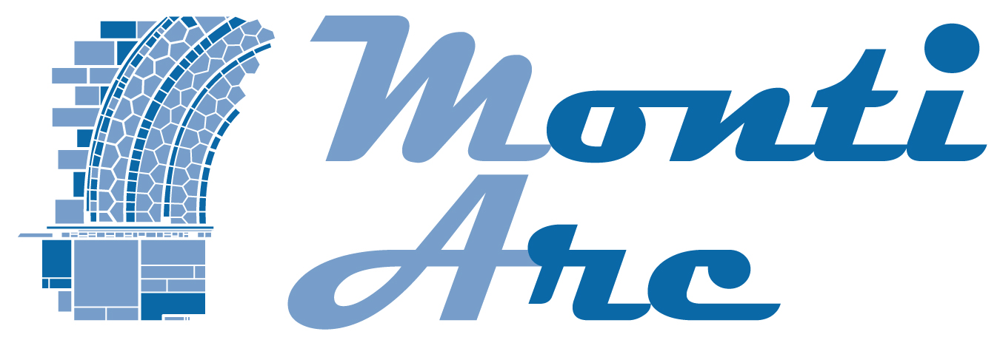

---
hide:
  - navigation
---
<!-- (c) https://github.com/MontiCore/monticore -->

<h1 align="center">
  <picture>
    
  </picture>
</h1>

# The MontiArc Architecture Description Language

MontiArc is an architectural definition language for component and connector models with enhanced connection facilities,
hierarchical decomposition, behavior description, and variability.

Architectures are described as [component](./Component.md) and connector systems in which autonomously acting components 
perform computations. Communication between components is regulated by connectors between the components’ [interfaces](./component/Interfaces.md), which are stable and built up by typed, directed ports. Components are either atomic or composed
of connected subcomponents. Atomic components yield [behavior descriptions](./Behavior.md). For [composed components](./component/Decomposition.md), the behavior emerges from the behavior of their subcomponents. 

## Further Information

* [MontiCore documentation](https://www.monticore.de/)
* [Publications about MBSE and MontiCore](https://www.se-rwth.de/publications/)
* [Licence definition](https://github.com/MontiCore/monticore/blob/HEAD/00.org/Licenses/LICENSE-MONTICORE-3-LEVEL.md)

© https://github.com/MontiCore/monticore