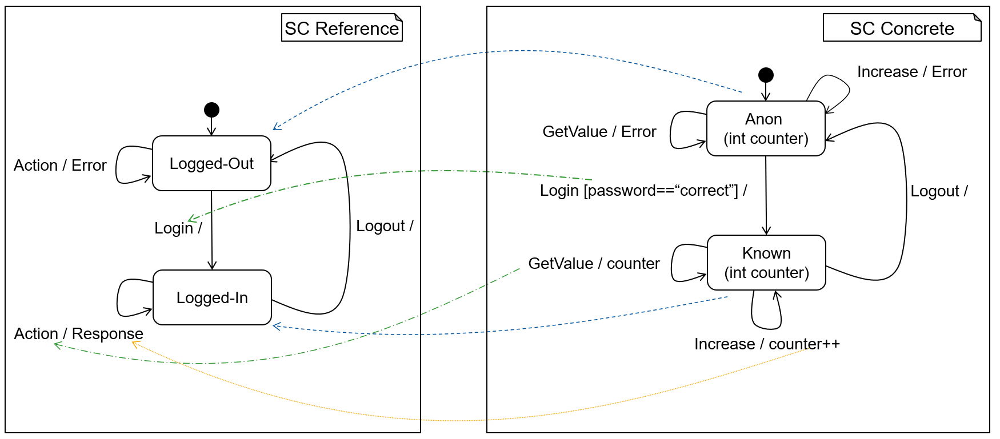

<!-- (c) https://github.com/MontiCore/monticore -->
# Conformance Checker for statechart

## Running Example 
As a running example to demonstrate the statechart
conformance checker, we use a login system.

### Reference model
The reference model is shown on the left side of the figure below.
This abstract model
shows an exemplary system with a simple login handling. Only
when a user is *LoggedIn* the input Actions lead to a *Response*.
When a user is *LoggedOut*, the input Action leads to an *Error*.
This statechart contains enough information to prove properties
over the behavior. Mainly that the system only responds after
login.



### Concrete Model
Using this statechart as a reference, we now develop a concrete system with more information, as seen on the right side
of the figure above. In the concrete system the *Login* is performed
with a *password* of type String. The internal state contains a
number named *counter*. This counter can be increased with
the input-action *incCounter*. With *getCounter* the current
value of the *counter* is returned as response

#### *Refinement*
The transition function of a statechart X can be
mathematically described as a predicate
````
transX : state → input → state → output → B
````

- The first parameter is the state from which the transition starts,
- the next parameter is the input message.
- The third parameter is
- the target-state of the transition and the fourth parameter is the output produced.

The predicate returns true iff the transition is
possible in the statechart.

For refinement of statecharts, it is sufficient to show that

```
∀state input nextState output .
    transRefined(state, input, nextState, output)
       ==> transOriginal(state, input, nextState, output)
```

Every transition possible in the refined statechart is also allowed in the original statechart. 

### Mapping 
To check conformance we additionally define mappings between concrete and reference statechart. Since there are
  the three data types input, output and state, we use three
  mappings instead of one.

````
stateMap {    // Definition of State Mapping
 Concrete.state == Known  
         ==> Reference.state == LoggedIn;
 Concrete.state == Anon   
         ==> Reference.state == LoggedOut;
}
inputMap {    // Definition of Input Mapping    
 Concrete.input == Input.GET_VALUE 
         ==> Reference.input == Input.ACTION;
 Concrete.password == "correct"    
         ==> Reference.input == Input.LOGIN;
[...]
````
### Conformance 
Combining the mapping with semantic refinement leads to the following formula:
```
∀state input output nextState.
     transConcrete(state, input, nextState, output)
     ==> transReference(mapState state, mapInput input,
         mapState nextState, mapOutput output)
```

When this formula holds, the mappings are correct and the
two statecharts are in a conformance relation. To check this
property we use the Java API of the SMT-Solver *Z3*. To get
more detailed output and increase performance the formula from
above is split up into multiple SMT-checks. For each transition
in the reference model, e.g., the transition from *Logged-In*
to *Logged-In* with input *Action* and output Response (see
Figure above), a separate SMT problem is created. This way each
SMT problem is smaller and thus more easily solvable, and we
get more information which can be used in the output.
The tool is part of the MontiArc project which is publicly
available on GitHub
. After building the project, the check can
be performed by executing the SCConformance.jar as seen
in Listing below.

```` shell
java -jar SCConformance.jar 
--reference "Reference.arc" "Reference.cd" 
--concrete "Concrete.arc" "Concrete.cd" 
--map "Mapping.map"
````

### Output 
When the models conform, the output of the tool
is a single line confirming this.
However, in case of non conformance, the tool provides sufficient information to the
developer on why they do not conform. As the problem is split
into multiple SMT-calls, we know which transition in the reference model is responsible. 

An example for input, state, and
output which lead to non-conformance are displayed.
To demonstrate this, the concrete model from Figure 5 is
modified. We add a transition from the state Anon to the state
Known with the action GetValue. This behavior is forbidden in
the reference statechart, since every action in the Logged-Out
state leads again to the Logged-Out state. Applying the conformance checker now leads to the following output:

```
[WARN]  Transition is *NOT* conform!
Concrete.arc:<28,2>: Anon->Known[input==Input.GET_VALUE]/{};

Possible Transition in Concrete Model(Concrete):
		From State: 	Anon{counter=2}
		With Input: 	input=GET_VALUE
		To State:   	Known{counter=2}
		Output:     	output=[ ] value=[ ] 

Impossible Transition in Reference Model(Reference):
		From State: 	NotLoggedIn
		With Input: 	input=ACTION
		To State:   	LoggedIn
		Output:     	output=[ ] 
```

In the first lines the file (Concrete.arc) and position (<28,2>)
of the non-conform concrete transition are shown. Furthermore,
the transition definition is printed so that the developer does no
need to open the file. After that, example input for a possible
transition in the concrete model are printed. Such a transition is
not possible in the reference model. 


## Further Information

* [Project root: MontiCore @github](https://github.com/MontiCore/monticore)
* [MontiCore documentation](http://www.monticore.de/)
* [**List of languages**](https://github.com/MontiCore/monticore/blob/opendev/docs/Languages.md)
* [**MontiCore Core Grammar Library**](https://github.com/MontiCore/monticore/blob/opendev/monticore-grammar/src/main/grammars/de/monticore/Grammars.md)
* [CD4Analysis Project](https://github.com/MontiCore/cd4analysis)
* [Best Practices](https://github.com/MontiCore/monticore/blob/opendev/docs/BestPractices.md)
* [Publications about MBSE and MontiCore](https://www.se-rwth.de/publications/)
* [Licence definition](https://github.com/MontiCore/monticore/blob/master/00.org/Licenses/LICENSE-MONTICORE-3-LEVEL.md)

[cd4c]: https://github.com/MontiCore/cd4analysis
[common-expr]: https://github.com/MontiCore/monticore/blob/opendev/monticore-grammar/src/main/grammars/de/monticore/expressions/CommonExpressions.mc4
[tool]: http://monticore.de/download/MCOCL.jar
[mbse-books]: http://mbse.se-rwth.de/
