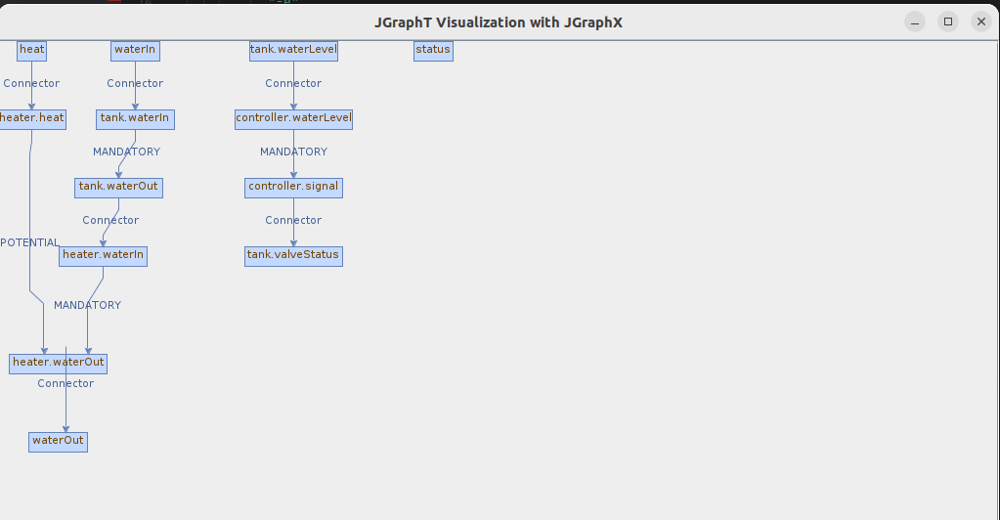

<!-- (c) https://github.com/MontiCore/monticore -->

# EffectChecker 

This documentation is intended for MontiArc modelers who want to analyze effect chains on their models using 
the EffectChecker tool.


## Example MontiArc Models:
The main component **Steamboiler**,
``` 
component SteamBoiler{

  port in double heat,
       in double waterIn ;

  port out double waterOut,
       out boolean status  ;


  WaterTank tank ;
  Heater heater ;
  Controller controller ;


  waterIn  -> tank.waterIn ;
  tank.waterOut -> heater.waterIn;
  heat -> heater.heat;
  heater.waterOut -> waterOut;

  controller.signal -> tank.valveStatus ;
  tank.waterLevel -> controller.waterLevel;

}
```
the subcomponents **Controller**,
``` 
component Controller {

   port  in  double  waterLevel;
   port  <<delayed>>  out boolean signal;

      automaton  {
              initial state Anon;

              Anon -> Anon [waterLevel == 0 ]/{signal = false;};
              Anon -> Anon [waterLevel != 0 ]/{signal = true;};
      }}
```
**Heater**,

``` 
component Heater {

  port  in  double heat,
        in  double waterIn,
        out double waterOut;

}
```

**WaterTank**.
``` 
component WaterTank {
  port  in double waterIn,
        in boolean valveStatus;

  port  out double waterOut ,
        out  double  waterLevel;

}
```
and the effect specifications. 

```
SteamBoiler {
  check potential effect: waterIn => waterOut;
  check no effect: waterIn => status;
  check no effect: heat => waterOut;
}

WaterTank { check mandatory effect: waterIn => waterOut;}

Heater {
  check mandatory effect: waterIn => waterOut;
  check potential effect: heat => waterOut;
}

Controller {
  check mandatory effect: waterLevel => signal;
}
```
* The effect specification is written in a file with .eff extension. 
* A file can contain effect specification for more than one component.


# Command Line Tool

This section describes the command line tool of the **EffectCheckerTool** language.
The tool enables to check effects between the input and output ports of a MontiArc component.
These effect rules have to be specified in te MontiArc effect file.
Parsing, coco-checking, creating symbol tables, storing symbols in symbol files is done implicitly.

The requirements for building and using the **EffectCheckerTool** tool are that (at least)
JDK 8 (JDK 11 and JDK 14 are also officially supported by us), Git, and Gradle
are installed and available for use in Bash.
If you're using Docker, you can also use the Docker container without
installing Java, Git, or Gradle.

The following subsection describes how to download the tool.
Then, this document describes how to build the tool from the source files.
Afterward, this document contains a tutorial for using the tool.

## Tutorial: Getting Started Using the EffectChecker Tool
The previous sections describe how to obtain an executable JAR file
(EffectChecker command line tool). This section provides a tutorial for
using the EffectChecker tool. The following examples assume
that you locally named the tool `MCEffect.jar`.
If you build the tool from the sources or used the `wget`
command above, then you are fine. If you manually downloaded
the tool, then you should consider renaming the downloaded JAR.

### First Steps
```
$ java -jar MCEffect.jar -h
```
Executing the Jar file without with option -h options prints usage information of the  
tool to the console:
```
usage: EffectChecker tool

 -e, --effect <arg>            Introduce the files containing the effect specification.
                               these files must have the extensions (.eff):
                             
 -mp, --modelpath              Introduce the path  to the models  directory.
                               The directory must contains the montiarc components (.arc),
                               optionally the class diagrams(.cd) where the data structures 
                               of the component are defined and  the effect specifiaction
                               (.eff).  
                               
                               
 -mc  --maincomponent          Introduce the qualified name of the main component whose
                               effect have to be checked.
                                
 -ma  --montiarc               Configure the tool for running on MontiArc components.
                                
 -sml, --sysml                 Configure the tool for runnning on SysMl components.
 
 -g, --graph                   When added, a windows with the effect a graph representing
                               The effect specifications will be opened.
                               
 -h, --help                     Prints this help dialog
```
To work properly, the tool needs the mandatory arguments `-e, -mp, -mc`. Per default, the tool is configured
to work with **MontiArc** Component (`ma`),


For trying this out, copy the `MCEffect.jar` into a directory of your
choice. Afterward, create a directory where you add all your models.

Now execute the following command:
```
java -jar MCEffect.jar -mp  steamboiler/  -mc steamboiler.SteamBoiler" -e  SteamBoiler.eff  -g 
```

For the following directory structure and the models shown on the top of this tutorial: 
```
WorkingDirectory
│
├── steamboiler
│   ├── SteamBoiler.arc
│   ├── Controller.arc
│   ├── heater.arc
│   ├── WaterTank.arc
│   └── Steamboiler.eff
│
└── MCEffect.jar
    
```
The run of the tool produces the following output in the terminal.

output for the first rule `check potential effect: waterIn => waterOut;`:
```
[INFO]  FullEffectChecker checking effect rule 'check potential effect: waterIn => waterOut;' of SteamBoiler with the PotentialEffectChecker......CORRECT
[INFO]  MCFullEffectChecker There is a path between the source and the target port without 'no effect' transition.
trace: waterIn -> tank.waterIn (mandatory effect) tank.waterOut -> heater.waterIn (mandatory effect) heater.waterOut -> waterOut
```
output for the second rule `check no effect: waterIn => status;`:

```
[INFO]  FullEffectChecker checking effect rule 'check no effect: waterIn => status;' of SteamBoiler with the NoEffectChecker......CORRECT
[INFO]  MCFullEffectChecker There is no path between the source and target ports without 'no effect' transition.
```
output for the third rule `heck no effect: heat => waterOut;` 
```
[INFO]  FullEffectChecker checking effect rule 'check no effect: heat => waterOut;' of SteamBoiler with the NoEffectChecker......INCORRECT
[INFO]  MCFullEffectChecker There is a path between the source and the target ports without no effect transition.
trace: heat -> heater.heat (potential effect) heater.waterOut -> waterOut
```
The tool checks all the Three rules (can be seen above) defined for component **SteamBoiler** and produces optionally
a trace and a description of the results.
Additionally, the tool produces show a graph representing the effect chains in the SteamBoiler:



## Further Information

* [Project root: MontiCore @github](https://github.com/MontiCore/monticore)
* [MontiCore documentation](http://www.monticore.de/)
* [**List of languages**](https://github.com/MontiCore/monticore/blob/opendev/docs/Languages.md)
* [**MontiCore Core Grammar Library**](https://github.com/MontiCore/monticore/blob/opendev/monticore-grammar/src/main/grammars/de/monticore/Grammars.md)
* [CD4Analysis Project](https://github.com/MontiCore/cd4analysis)
* [Best Practices](https://github.com/MontiCore/monticore/blob/opendev/docs/BestPractices.md)
* [Publications about MBSE and MontiCore](https://www.se-rwth.de/publications/)
* [Licence definition](https://github.com/MontiCore/monticore/blob/master/00.org/Licenses/LICENSE-MONTICORE-3-LEVEL.md)

[cd4c]: https://github.com/MontiCore/cd4analysis
[common-expr]: https://github.com/MontiCore/monticore/blob/opendev/monticore-grammar/src/main/grammars/de/monticore/expressions/CommonExpressions.mc4
[tool]: http://monticore.de/download/MCOCL.jar
[mbse-books]: http://mbse.se-rwth.de/
